```mermaid
erDiagram

  %% =========================================================
  %% IDENTITY SCHEMA
  %% =========================================================

  identity_party {
    UUID   party_id         PK
    TEXT   party_type
    TEXT   party_subtype
    TEXT   name_token
    TEXT   display_name
    TEXT   tax_id_token
    CHAR2  country_code
    TEXT   resolution_status
    NUM    resolution_confidence
    UUID   merged_into_party_id
    TEXT   tenant_id
  }

  identity_party_account {
    UUID   account_id            PK
    UUID   party_id              FK
    TEXT   account_type
    BOOL   is_on_us
    TEXT   institution_routing_number
    TEXT   institution_name
    TEXT   institution_swift_bic
    TEXT   institution_iban_token
    CHAR2  institution_iban_country_code
    TEXT   account_number_token
    TEXT   proxy_type
    TEXT   proxy_value_token
    TEXT   tenant_id
  }

  identity_party_account_rail_ref {
    UUID   rail_ref_id        PK
    UUID   account_id         FK
    TEXT   rail_type
    TEXT   rail_identifier_type
    TEXT   rail_identifier_token
    TEXT   rail_identifier_plain
    TEXT   tenant_id
  }

  identity_party_address {
    UUID   address_id         PK
    UUID   party_id           FK
    TEXT   address_type
    TEXT   city
    TEXT   state_province
    TEXT   postal_code
    CHAR2  country_code
    TEXT   address_line1_token
    TEXT   address_line2_token
    TEXT   swift_bic
    TEXT   correspondent_bank_bic
    TEXT   correspondent_bank_name
    TEXT   iban_token
    CHAR2  iban_country_code
    TEXT   bank_name
    TEXT   tenant_id
  }

  identity_party_relationship {
    UUID   relationship_id    PK
    UUID   party_id_a         FK
    UUID   party_id_b         FK
    TEXT   relationship_type
    TEXT   role_a
    TEXT   role_b
    NUM    ownership_percentage
    DATE   effective_date
    DATE   expiry_date
    BOOL   is_active
    TEXT   tenant_id
  }

  identity_biller_registry {
    UUID   biller_registry_id PK
    UUID   party_id           FK
    TEXT   biller_id
    TEXT   standard_biller_id
    TEXT   biller_category
    TEXT   aggregator_name
    TEXT   biller_fi_routing
    TEXT   biller_fi_account_token
    TEXT   tenant_id
  }

  identity_party_resolution_event {
    UUID   resolution_event_id PK
    UUID   source_party_id     FK
    UUID   target_party_id     FK
    TEXT   event_type
    TEXT   resolution_method
    TEXT   block_key
    TEXT   match_rule
    NUM    confidence_score
    JSONB  match_attributes
    TEXT   resolved_by
  }

  %% =========================================================
  %% SILVER LAYER
  %% =========================================================

  lake_unified_transactions {
    UUID   transaction_id         PK
    TEXT   tenant_id
    TEXT   payment_type
    TEXT   payment_subtype
    TEXT   payment_rail
    TEXT   direction
    NUM    amount
    CHAR3  currency_code
    CHAR3  original_currency_code
    NUM    original_amount
    NUM    fx_rate
    TEXT   fx_rate_source
    TS     fx_rate_timestamp
    TEXT   fx_charges_borne_by
    CHAR3  settlement_currency_code
    TEXT   originator_swift_bic
    TEXT   beneficiary_swift_bic
    CHAR2  originator_iban_country_code
    CHAR2  beneficiary_iban_country_code
    TEXT   status
    TS     transaction_ts
    DATE   settlement_date
    BOOL   is_on_us
    TEXT   on_us_settlement_type
    UUID   originator_party_id    FK
    UUID   originator_account_id  FK
    TEXT   originator_account_token
    TEXT   originator_routing_number
    UUID   beneficiary_party_id   FK
    UUID   beneficiary_account_id FK
    TEXT   beneficiary_account_token
    TEXT   beneficiary_routing_number
    TEXT   originator_resolution_status
    TEXT   beneficiary_resolution_status
    TS     identity_resolution_hook_ts
    TEXT   originator_block_key
    TEXT   originator_match_rule
    TEXT   beneficiary_block_key
    TEXT   beneficiary_match_rule
    JSONB  rail_details_json
    JSONB  compliance_json
    TEXT   schema_version
  }

  %% =========================================================
  %% RAW LAYER
  %% =========================================================

  raw_ach {
    TEXT txn_id PK
    TEXT tenant_fi_id
    NUM  txn_amt
    TEXT odfi_routing
    TEXT rdfi_routing
    TEXT orig_acct_num
    TEXT recv_acct_num
  }

  raw_wire {
    TEXT wire_txn_id PK
    TEXT orig_aba
    TEXT bene_aba
    TEXT orig_acct
    TEXT bene_acct
    TEXT imad
  }

  raw_zelle {
    TEXT zelle_ref_id PK
    TEXT sender_fi_routing
    TEXT receiver_fi_routing
    TEXT sender_email
    TEXT receiver_proxy
  }

  %% =========================================================
  %% GOLD LAYER
  %% =========================================================

  gold_by_payment_type {
    TEXT tenant_id
    TEXT payment_type
    DATE period_date
    INT  txn_count
    NUM  total_amount
    INT  on_us_count
    NUM  on_us_amount
    INT  off_us_count
    NUM  off_us_amount
  }

  %% =========================================================
  %% REFERENCE + METADATA
  %% =========================================================

  ref_on_us_institutions {
    TEXT routing_number PK
    TEXT tenant_id
    TEXT institution_name
    BOOL is_active
  }

  metadata_source_to_target {
    INT  mapping_id        PK
    TEXT source_system
    TEXT payment_type
    TEXT source_field
    TEXT target_field
    TEXT transformation_type
    TEXT sensitivity_class
    TEXT ir_role
    BOOL is_on_us_indicator
  }

  %% =========================================================
  %% RELATIONSHIPS
  %% =========================================================

  identity_party ||--o{ identity_party_account : "has"
  identity_party ||--o{ identity_party_address : "has"
  identity_party ||--o{ identity_party_resolution_event : "source_of"
  identity_party ||--o{ identity_party_resolution_event : "target_of"
  identity_party ||--o{ identity_party_relationship : "party_id_a"
  identity_party ||--o{ identity_party_relationship : "party_id_b"
  identity_party ||--o| identity_biller_registry : "biller extends"

  identity_party_account ||--o{ identity_party_account_rail_ref : "has"

  lake_unified_transactions }o--o| identity_party : "originator"
  lake_unified_transactions }o--o| identity_party : "beneficiary"
  lake_unified_transactions }o--o| identity_party_account : "orig_account"
  lake_unified_transactions }o--o| identity_party_account : "bene_account"

  raw_ach       }o--o{ lake_unified_transactions : "ETL"
  raw_wire      }o--o{ lake_unified_transactions : "ETL"
  raw_zelle     }o--o{ lake_unified_transactions : "ETL"

  lake_unified_transactions }o--o{ gold_by_payment_type : "aggregates"
```

# JHBI Unified Payments Platform — Entity Relationship Diagram

Last updated: 2026-03-10

---

---

## Design Notes

**FX / Multi-Currency** — `fx_rate`, `original_currency_code`, `original_amount`, `fx_rate_source`, `fx_rate_timestamp`, and `fx_charges_borne_by` are first-class columns on `unified_transactions` rather than buried in `rail_details_json`. This makes cross-rail FX reporting a simple query. The `chk_fx_consistency` constraint ensures the FX columns are only populated together.

**IBAN / BIC on addresses and accounts** — `party_address` carries SWIFT BIC, correspondent bank BIC, tokenized IBAN, and IBAN country code, aligning with SWIFT MT103 / ISO 20022 pacs.008. `party_account` adds `institution_iban_token` and `institution_swift_bic` for international account lookups.

**Party relationships** — `identity.party_relationship` records typed links between two party records: joint accounts, authorized signers, parent-subsidiary hierarchies, beneficial ownership, trusts, and guarantors. Both directions use the same row; `role_a` and `role_b` clarify the direction.

**Biller registry** — `identity.biller_registry` ties BillPay biller IDs (iPay, Payrailz, BPS) to canonical `identity.party` records. This makes it possible to do cross-FI biller analytics without re-matching biller names.

**Block-and-key identity resolution** — The IR service runs deterministic rules rather than an ML ensemble: `EXACT_TOKEN` (1.00) → `ROUTING_ACCOUNT` (≥0.95) → `PROXY_EXACT` (≥0.90) → `NAME_ROUTING` (≥0.80) → `NEW_PARTY`. `block_key` and `match_rule` are surfaced on `unified_transactions` and `party_resolution_event` so you can audit every match decision without touching the IR service logs.

**On-us detection** — `is_on_us` is derived at ETL time via `ref_on_us_institutions`. No runtime lookup needed.

**Deferrable foreign keys** — FKs from `unified_transactions` to the identity schema are `DEFERRABLE INITIALLY DEFERRED`. This lets CDC bulk loads insert transactions before identity records land without triggering FK violations.

**IR queue index** — A partial index on UNRESOLVED rows in `unified_transactions` keeps the IR service poll query fast as the table grows.
